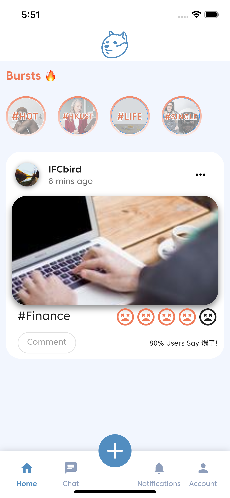
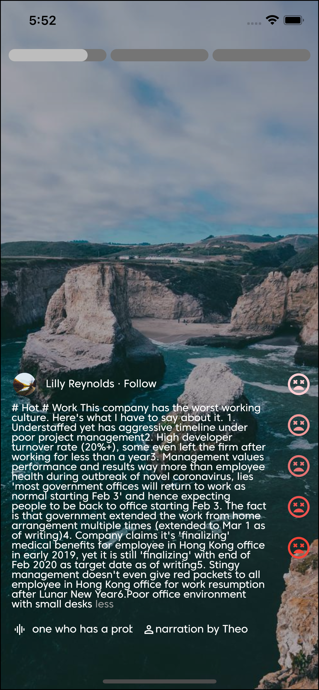

## Background 
Students and professionals alike suffer from stress every day due to various factors such as poor work-life balance, unreasonable customers, relationship problems, and many more during the past few years. In some cases, they may even develop signs of anxiety and depression. As these stresses pile up, many feel the need for an outlet to express the various complaints and grievances that they accrue. Although several social media platforms are available for users to voice out their complaints, to date, none are specific to complaint content creation and has yet to take an active approach targeted towards these users, such as providing them with constructive feedback and addressing their mental well-being. 

## Proposed Solution
Our new platform called ‘Chihuahua’ provides flexibility to users in choosing which kind of complaints they seek to post online. These two options are instrumental complaints (hope of bringing a change) or expressive complaints (search for validation and sympathy). Users would have access to a mood-palette generator for day-to-day mood tracking in which their moods are detected through real-time NLP multi-mood detection/analysis. Furthermore, users who subscribed to our premium features would have access to a library of self-growth methods and cognitive behavioural therapy on demand. 
- Channel: recorded audio or video – personalized stories and posts 
- Main features: mood-palette generation, real-time NLP multi-mood detection/analysis, and cognitive behavioural therapy (CBT) 
- Market focus: university students and professionals 
- Revenue stream: freemium model (monthly subscription-based)  
- Pricing: Chihuahua Personal Free($0), Chihuahua Personal Pro ($79/month), Chihuahua Enterprise ($179/month) 

## Design and Implementation (built with Figma  and Flutter )

Figma Design Overview: 

A quick look at our main interfaces for Chihuahua built with Flutter and Figma :

Homepage             |  Burst Stories            | Create Bursts                     |
:-------------------:|:-------------------------:|:---------------------------------:|
  |  
 | 
 | 


## How to Use 

**Step 1:**

Download or clone this repo by using the link below:

```
https://github.com/AnandSinhaProjects/Mental_Health_App_With_NLP.git
```

**Step 2:**

Go to project root and execute the following command in console to get the required dependencies: 

```
flutter pub get 
```

**Step 3:**

Start running the App by running the following command in the working directory with pubsec.yaml

```
flutter run
```
